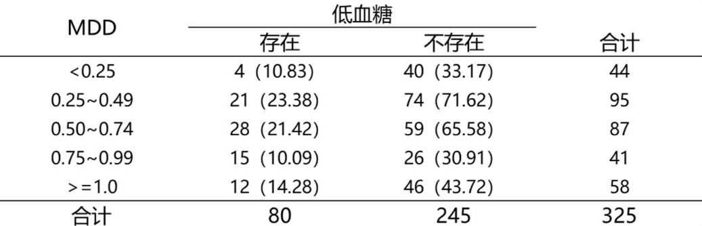

# Fisher精确检验
## 一、动机
Fisher检验和卡方独立性检验、卡方同质性检验的目的完全相同，都是为了检验两个分类变量之间的独立性。然而，卡方检验天生就依赖于大样本的近似。当单元格中有**超过$20\%$的期望频数小于5**时，卡方检验的统计量和真实的卡方分布就会有较大的偏差，继续使用卡方检验就会失效。

为了说明这种情况，让我们考察这样一个问题，检验$A$、$B$两种药物的疗效是否有差异：


可以看到第一行第一列的单元格，它的期望频数为$\frac{15 \times 10}{40} = 3.75 < 5$；虽然只有一个单元格这样，但考虑到这是一个$2 \times 2$列联表，一个单元格的占比已经达到$1 / 4 = 25\%$了，超过了上述提到的$20\%$这个经验比例。继续采用卡方检验就会得到不恰当的结论。

## 二、基本思想
Fisher的想法是从数据生成角度出发，将原假设成立下的数据看成是通过**超几何分布**生成的。具体而言，当药物和疗效之间没有关系时，原数据可以看成是：

- 40个球中，有10个A球，30个B球。现在抽取了15个球，其中恰好有8个是A球，7个是B球。

- 40个球中，有15个“有效”球，25个“无效”球。现在抽取了10个球，其中恰好有8个“有效”球，2个“无效”球的概率。

这两种视角实际上是完全等价的。前者是把有效和无效平等看待；后者是将$A$药和$B$药平等看待。它们都表明了两个变量的取值互不干扰。

记第$i$行第$j$列单元格的值为$n_{ij}$，那么上述两种情况的概率可以表示为：
\[
P(n_{11} = 8) = \frac{\binom{10}{8} \binom{30}{7}}{\binom{40}{15}} \approx 0.002277     
\]或者：
\[P(n_{11} = 8) = \frac{\binom{15}{8} \binom{25}{2}}{\binom{40}{10}} \approx 0.002277\]

## 三、统计量
Fisher精确检验的统计量无法定义成一个函数，这一点和过去我们所学的统计量就是一个根据样本计算得到的值有点不同。但为了符合我们统计学的基本逻辑，我们应该给它一个广义的统计量定义：Fisher检验的统计量正是**表格本身**。

## 四、拒绝域
拒绝域依赖于备择假设以及统计量的**含义**。回到上面的例子。：
- 对于**单侧检验**，如果备择假设是$A$药比$B$药有效，那么拒绝域就是表格中药物$A$有更多有效治疗案例，$p$值就是$P(n_{11} \geq 8)$；
- 对于**双侧检验**，备择假设是$A$药和$B$药没有差别，那么拒绝域应该就是表格中药物$A$的有效治疗数太多或太少。$p$值就是$P(n_{11} \geq 8 或 n_{11} \leq c)$。$c$应该满足$P(n_{11} = c) \leq P(n_{11} = 8)$且$c \neq 8$。结果我们发现没有符合条件的$c$值，因此双侧检验的$p$值恰好也是$P(n_{11} \geq 8)$。

如果你觉得拗口，双侧检验的$p$值还可以表述成：**极端表格概率之和**。上述例子中，只有$n_{11} \geq 8$时属于极端表格。

## 五、多元情况
上面只是简单介绍了2*2列联表的情形，数据的生成可以看作是一个典型的超几何分布。但对于更一般的$m * n$列联表，就需要“多元”超几何分布了。这事实上也并不复杂。例如下面这个例子：


我们想探究低血糖与胰岛素每日平均剂量(MDD)的关系。那么得到如表所示的概率就是：
\[\begin{aligned}
&P(n_{11} = 4,n_{21} = 21, ..., n_{51} = 12) \\
&= \frac{\binom{44}{4} \binom{95}{21} \binom{87}{28} \binom{41}{15} \binom{58}{12}}{\binom{325}{80}}
\end{aligned}\]

双侧检验$p$值仿照第四小节计算。但这需要我们枚举所有不同的表格出现的概率，其计算量之巨不言而喻。当然Fisher精确检验本身就是小样本的宠儿，对于上面这个例子，卡方检验是更优的选择，且计算结果不会和Fisher的结果有明显差异。

## 六、R语言实现
针对上面第一个问题，先输入数据：
```
data <- matrix(c(8, 2, 7, 23), nrow = 2)
```
使用卡方检验：```chisq.test(data)```得到：
```

	Pearson's Chi-squared test with Yates' continuity correction

data:  data
X-squared = 8, df = 1, p-value = 0.004678

警告信息:
In chisq.test(data) : Chi-squared近似算法有可能不准
```

改用Fisher精确性检验```fisher.test(data)```：
```
Fisher's Exact Test for Count Data

data:  data
p-value = 0.002429
alternative hypothesis: true odds ratio is not equal to 1
95 percent confidence interval:
   1.856547 143.340082
sample estimates:
odds ratio 
  12.12648 
```
odds ratio是优势比。优势比>1表示正关联，<1表示负关联。上述数据可以解读为：药物A有效的优势，是药物B的12.13倍。说人话就是，药物$A$比药物$B$强太多了。